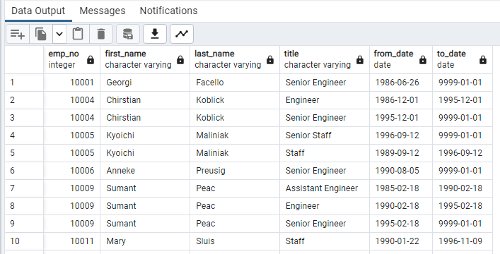
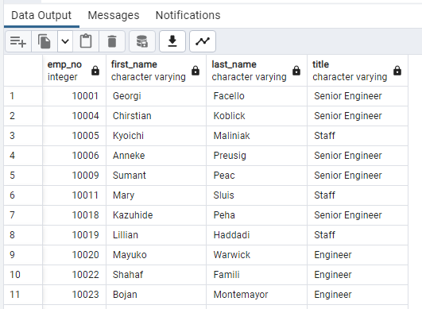
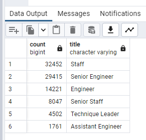
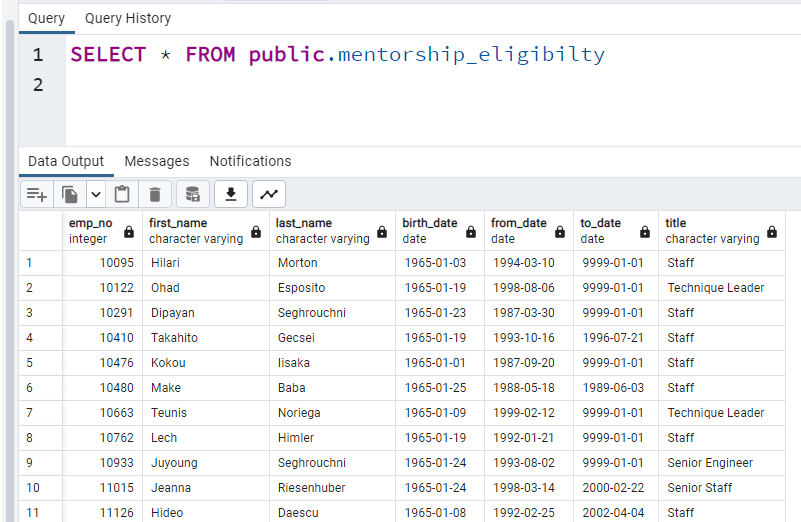

# Pewlett-Hackard-Analysis

## Background

Pewlett Hackard is a large company boasting several thousand employees, and it's been around for a long time. As baby boomers begin to retire at a rapid rate, Pewlett Hackard is looking toward the future in two ways. First, it's offering a retirement package for those who meet certain criteria. Second, it's starting to think about which positions will need to be filled in the near future. Therefore, they have requested to organize the company database by using PostgreSQL and pgAdmin. 

## Purpose

Create tables that hold the number of retiring employees per title, and identify employees who are eligible to participate in a mentorship program.

## Objectives

Deliverable 1: The Number of Retiring Employees by Title

Deliverable 2: The Employees Eligible for the Mentorship Program

Deliverable 3: A written report on the employee database analysis (README.md)

## Resources

- PostreSQL
- pgAdmin 4

- Quick DBD

## Deliverable 1: The Number of Retiring Employees by Title

## Deliverable 2: The Employees Eligible for the Mentorship Program

## Results

- The retirement_titles table shows all the eligible employees for retirement and how long they have worked at each position over the course of their career.
- The unique_titles table shows the most recent title for each employee eligible for retirement.
- As shown on the retiring_titles table the number of senior enginneer and senior staff that are retiring is approximately double the number of engineer and staff employees that are retiring. The number of managers that are retiring is the lowest out of all the titles, at two. The second lowest number of retiring employees by title is assistant enginner.
- The mentorship_eligibility shows all the employees eligible to mentor and their most recent title.

## Summary

**How many roles will need to be filled as the "silver tsunami" begins to make an impact?**

In total there will be over 90,000 roles that will need to be filled by the end of the "silver tsunami".

**Are there enough qualified, retirement-ready employees in the departments to mentor the next generation of Pewlett Hackard employees?**

There are (1,549) retirement-ready employees not enough in the departments to mentor the next generation of Pewlett Hackard employees if we assume a one to one ratio.

